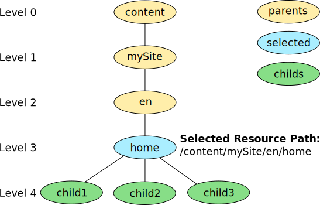
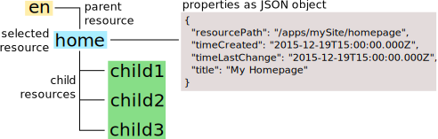
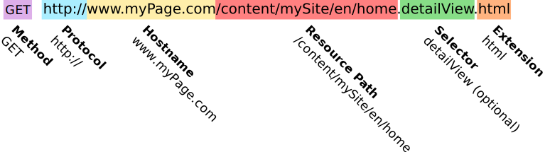

# Dachshund WCMS
Dachshund is a fast and lightweight WCMS. It's goal is to provide a content centric WCMS with a transparent and structured REST API to access and modify its data. It is tailored to support state of the art web application development with HTML5, CSS3 and Javascript.

## Unstructured Content / Hierarchical Relationship
Dachshund comes bundled with a content repository and the API to access it. So there is no need for an additional database. Everything you need is your local file system. As the web is unstructured our content is unstructured as well. There is no need of database design. As web pages and their content is hierarchical structured, the relationship between data elements - we call them _resources_ - is defined in the same same way.

## Resource
A resource has always a parent resource and may have multiple child resources. Furthermore, each resource has properties which represent the specific information of the resource.

The abstract class [Resource](Resource.html) and documents the members and the methods to access the resource information. 

## REST API
Each resource can be referenced through it's path in the hierarchy. The access takes place by stating the resource path, which is usually a sub path of _/content_, directly behind the URL. To render the content, the representation of the content is defined within the extension. Furthermore one or multiple selectors can be defined to get different views. 

The class [RequestPathInfo](RequestPathInfo.html) documents the members and methods to access the information passed with the request.

## Component Handling
To build the view of a resource is requires a component resource to process the content resource data and provide the rendered information in the way they were requested. To do this the content 

## Folder Structure
- __/apps__ _(system as well as custom application code)_
- __/content__ _(content for each site and their sub pages)_
- __/config__ _(application configuration)_
- __/home/users__ _(system users)_
- __/home/groups__ _(system usergroups)_
- __/libs__ _(Client side libraries for javascript, stylesheet frameworks or images)_

## System Requirements
- Mac OS X or Linux (Theoretical Windows)
- Node.js including npm (Version 5.2 and greater)
- Internet access to clone Dachshund from git and to download 3rd party npm modules
- GIT Version Control System (command line client or some UI client)

## Setup

### Step 1 - Clone Dachshund from GitHub
Use your UI client and clone the repository _https://github.com/sbrinkmann/dachshund_ change to the flag version 2.0 or use a command line client.

> cd basepath/to/clone/dachshund
> git clone https://github.com/sbrinkmann/dachshund
> cd dachshund
> git checkout 2.0 

### Step 2 - Finish installation
Open a command line window and change to the dachshund folder. There you have to download the dependencies with node package manager as they're defined in the _package.json_.

> cd path/to/dachshund
> npm install

## Startup
Dachshund provides two methods to be started as normal or as debug application. The difference is that with one method its possible to use remote debugging. The other one starts just the application and redirects the log output. Into 

## Version History
- __2.0__ - First publicly available version. It is contains the core of _Dachshund_ and all functionality to build applications or rich frontend on top of it.
  - REST API
  - Resource Resolving and Managing
  - Component Handling
  - Basic Authentication and Authorization
  - Central configuration framework
  - Render HTML templates with [Jazz](https://github.com/shinetech/jazz) templating engine
  - Render CSS templates with Less
- __1.0__ - Was the first implementation which was a proof of concept and used only for internal implementations, it provided the same functionality as the first published version 2.0 but wasn't tested or documented in any kind

## Wishlist
Even when Dachshund reached the version 2.0 the current implementation provide primarily the core functionality for a WCMS. 
- Authoring and administration web HTML5 frontend
- Functionality to replicate content between dachshund instances
- Functionality to use Dachshund with SAML and/or LDAP
- Possibility to use databases like MongoDB or CouchDB